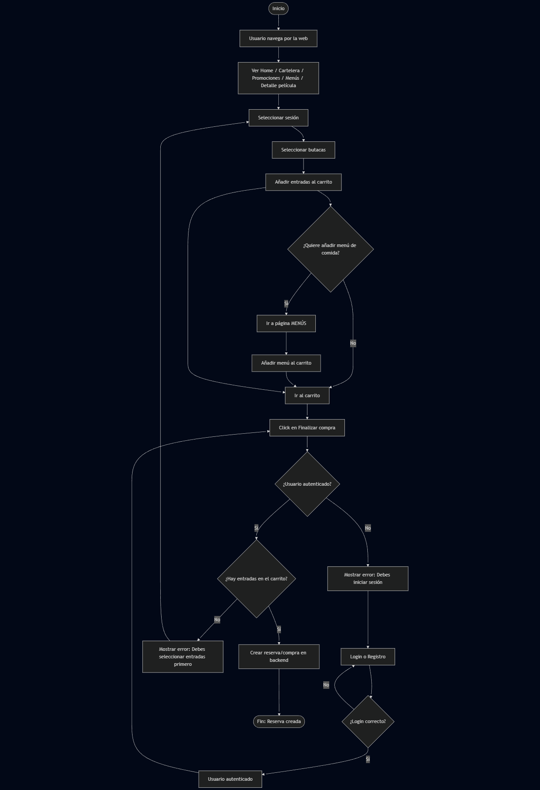
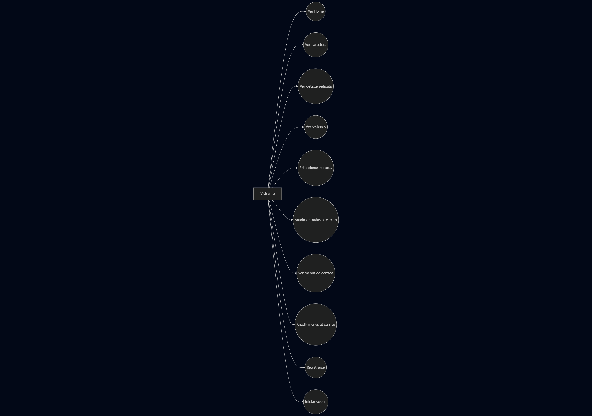

# 🎬 CineVerse – Frontend

Aplicación frontend de **CineVerse**, una plataforma web para la gestión y reserva de entradas de cine con compra de menús de comida y panel de administración.

Este repositorio contiene **únicamente el frontend**, desarrollado con React y TypeScript.

---

## 🧑‍💻 Descripción general

El frontend de CineVerse permite a los usuarios:

- Navegar libremente por la web (sin necesidad de registro).
- Consultar cartelera, sesiones y detalles de películas.
- Seleccionar butacas y añadir entradas al carrito.
- Añadir menús de comida asociados a la compra de entradas.
- Finalizar la compra únicamente si el usuario ha iniciado sesión.
- Acceder a un panel de administración en función del rol.

---

## ✨ Funcionalidades principales

### 🌐 Parte pública (usuarios)

#### Home
- Navbar fijo presente en toda la aplicación.
- Carrusel principal (Swiper) con las **películas destacadas del mes (MVP)**:
  - Reproducción automática cada 7 segundos.
  - Controles manuales (siguiente / anterior).
  - Botón **Ver detalles** que redirige al detalle de la película.
- Carrusel de fechas:
  - Muestra las sesiones disponibles para cada día.
  - Cada tarjeta indica horario y sala.
  - Click en la tarjeta → Detalle de la película.
  - Click en el horario → Selección de butacas.
- Footer fijo con formulario de newsletter (no funcional actualmente).

#### Cartelera
- Listado completo de las películas activas.
- Acceso al detalle de cada película.

#### Detalle de película
- Información detallada: sinopsis, género, edad recomendada.
- Carrusel de sesiones por fecha.
- Botones:
  - Ver trailer (no funcional).
  - Comprar entradas (no funcional).

#### Selección de butacas
- Visualización de asientos disponibles y ocupados.
- Selección múltiple de butacas.
- Botón **Confirm booking** que añade las entradas al carrito.

#### Carrito
- Visualización de entradas y menús añadidos.
- Botón **Finalizar compra**:
  - Solo disponible si el usuario ha iniciado sesión.
  - Si no está autenticado, se muestra un mensaje de error.

#### Menús de comida
- Cuatro menús disponibles:
  - Combo Familiar
  - Combo Clásico
  - Combo Dulce
  - Combo Premium
- Los menús solo pueden comprarse si hay entradas en el carrito.
- Enlace a la sección de promociones.

#### Promociones
- Página informativa con promociones activas.
- Sección Club CineVerse (no funcional).

---

### 🔐 Autenticación

- Registro mediante email y contraseña.
- Inicio de sesión mediante email y contraseña.
- Tras iniciar sesión:
  - Menú desplegable con:
    - **Mis reservas**.
    - **Mis datos** (email y contraseña enmascarada).
- Los usuarios no autenticados no pueden finalizar compras.

---

### 🛠 Panel de administración (rol Admin)

Acceso exclusivo para usuarios con rol **admin** mediante la ruta `/admin`.

Funciones disponibles:
- Dashboard con métricas generales del cine.
- Gestión de películas (crear, editar, eliminar).
- Gestión de sesiones.
- Gestión de salas.
- Gestión de usuarios (visualización).
- Gestión de películas MVP para el carrusel principal.

---

## 🧱 Tecnologías utilizadas

- **Vite**
- **React**
- **TypeScript**
- **Zustand** (estado global)
- **React Router**
- **Swiper**
- **react-icons**
- **react-hot-toast**
- CSS Modules / estilos personalizados

---

## 📌 Notas finales

Este repositorio depende del backend de CineVerse, que debe estar ejecutándose para que la aplicación funcione correctamente.

Algunas funcionalidades están en desarrollo o no implementadas intencionadamente (newsletter, trailers, bloqueo de usuarios).

## Inicialización del proyecto

### Requisitos

- Node.js v18+
- npm v9+

### Instalación

1. **Clonar el repositorio**

   ```bash
   git clone https://github.com/samuelmeleroWEB/frontendCineverse.git
   cd frontendCineverse
   ```

2. **Instalar dependencias**

   ```bash
   npm install
   ```

3. **Ejecutar servidor de desarrollo**
   ```bash
   npm run dev
   ```
   Abre [http://localhost:5173](http://localhost:5173) para verlo en el navegador.

---
## 📁 Estructura del proyecto

```text
src/
├── assets/
├── components/
├── pages/
├── router/
├── services/        # Llamadas a la API
├── store/           # Zustand
├── main.tsx
└── App.tsx
 ```
## 📊 Diagramas

### Diagrama de flujo


### Diagrama de casos de uso
